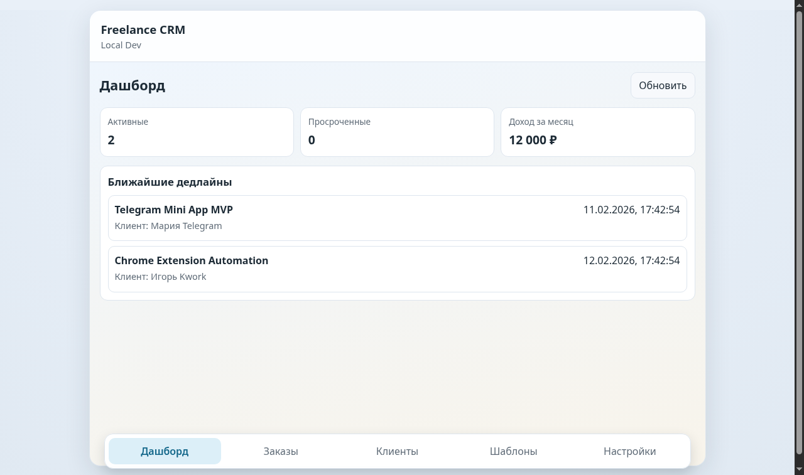
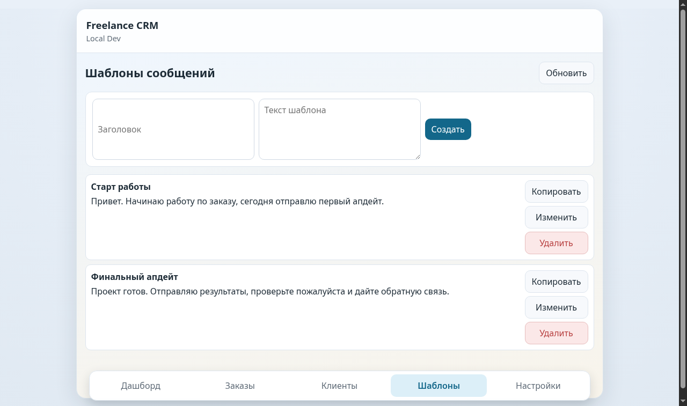
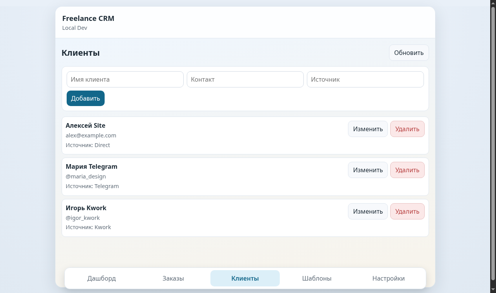

# Freelance CRM Mini App

Telegram Mini App для фрилансера: клиенты, заказы, дедлайны, шаблоны сообщений, напоминания и базовая аналитика.

## Что реализовано в MVP

- Telegram auth endpoint с серверной проверкой `initData` (`POST /auth/telegram`)
- CRUD: клиенты, заказы, задачи, заметки, шаблоны, напоминания
- Переключение статусов заказов по фиксированному enum
- Дашборд с 4 метриками: активные, просроченные, доход за месяц, ближайшие дедлайны
- SQLite + Prisma схема и миграции
- React-интерфейс с 6 экранами: Dashboard, Orders, Order Details, Templates, Clients, Settings

## Структура

```
frontend/   # React + Vite Mini App
backend/    # Fastify API + Prisma + SQLite
shared/     # Общие типы
```

## Требования

- Node.js 20+
- npm 10+

## Быстрый старт

### 1) Backend

```bash
cd backend
npm install
npm run prisma:generate
npm run prisma:migrate
npm run prisma:seed
npm run start
```

Backend поднимается на `http://localhost:3000`.

### 2) Frontend

```bash
cd frontend
npm install
npm run dev
```

Frontend поднимается на `http://localhost:5173`.

### 3) Проверка

- `GET http://localhost:3000/health`
- открой `http://localhost:5173`

## Telegram auth

- Продовый режим: отправляйте `initData` в `POST /auth/telegram`
- Локальный dev-режим: если Telegram-контекста нет, UI выполняет dev-auth через тот же endpoint
- Для проверки подписи укажите `BOT_TOKEN` в `backend/.env`
- После успешного `POST /auth/telegram` backend возвращает signed token, который передается в `Authorization: Bearer <token>`
- В production обязателен `AUTH_TOKEN_SECRET` (используется для подписи auth token)

## Скриншоты MVP

### Dashboard



### Orders


### Order Details


### Templates



### Clients



### Settings


## API (MVP)

- `POST /auth/telegram`
- `GET /auth/me`
- `GET /dashboard/summary`
- `GET/POST/PATCH/DELETE /clients`
- `GET/POST/GET:id/PATCH/DELETE /orders`
- `POST /orders/:id/status`
- `GET/POST /orders/:id/tasks`
- `PATCH /tasks/:id`
- `GET/POST /orders/:id/notes`
- `GET/POST/PATCH/DELETE /templates`
- `GET/POST/PATCH/DELETE /reminders`
- `GET /health`
